# EduSync

Student management application built with PHP and MySQL — v1.5.0.

## Screenshots

### Desktop

| 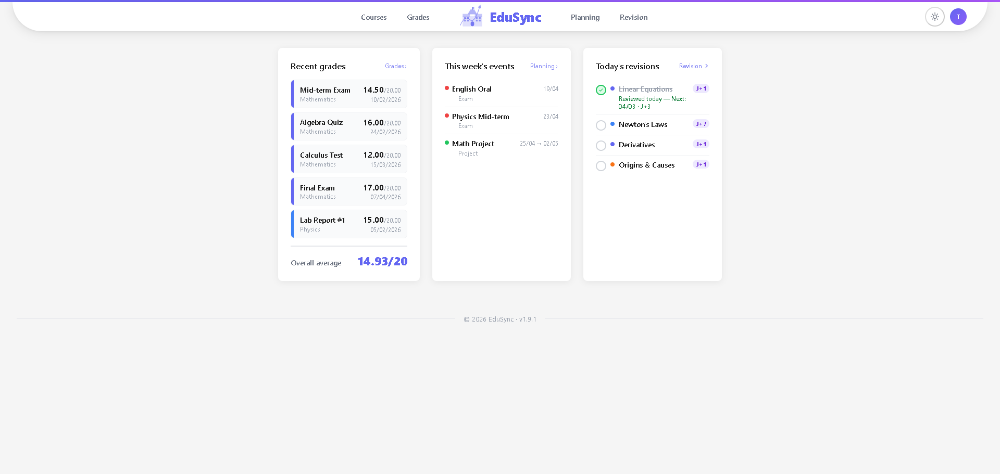 | 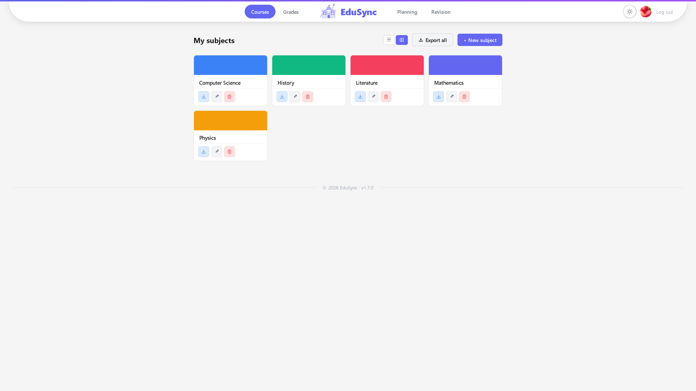 |
|:---:|:---:|
| **Dashboard** | **Courses** |
| 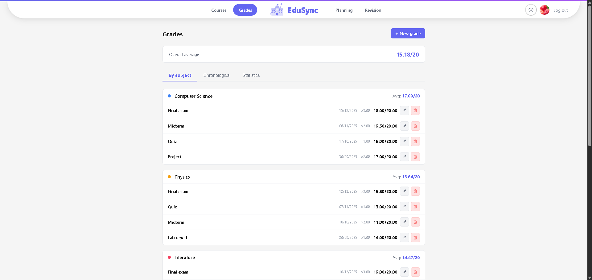 | 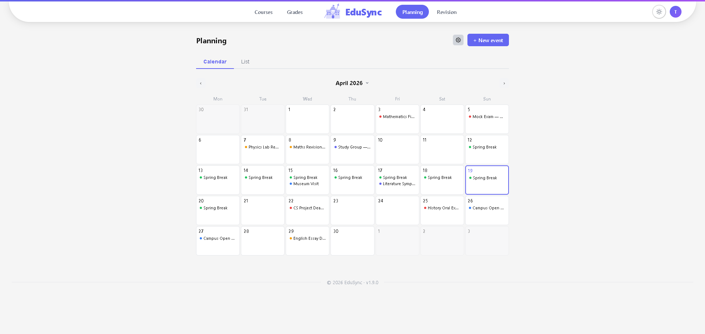 |
| **Grades** | **Planning** |
| 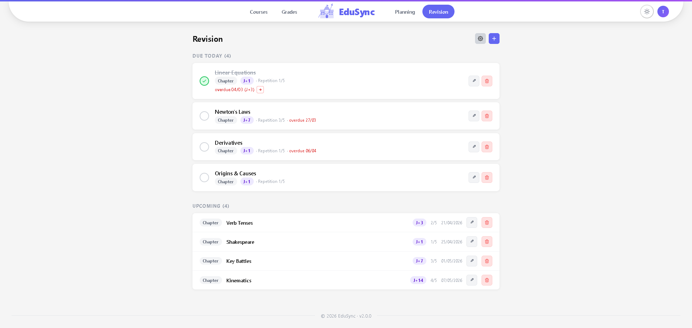 | 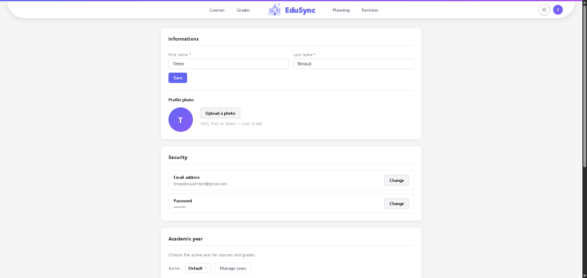 |
| **Revision** | **Profile** |

### Mobile

| 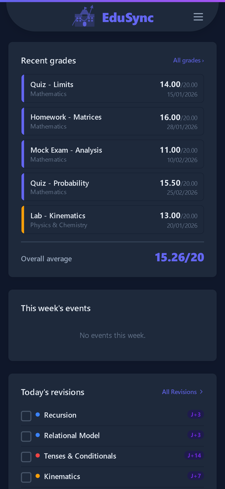 | 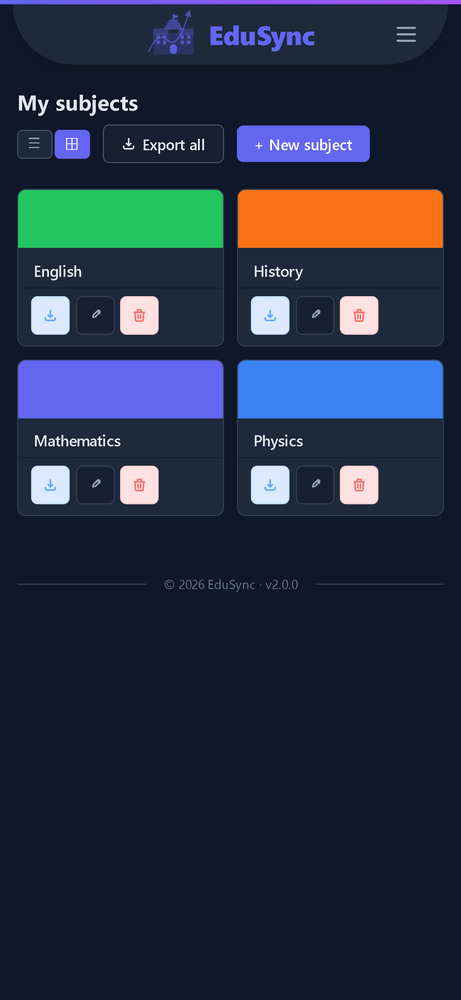 | 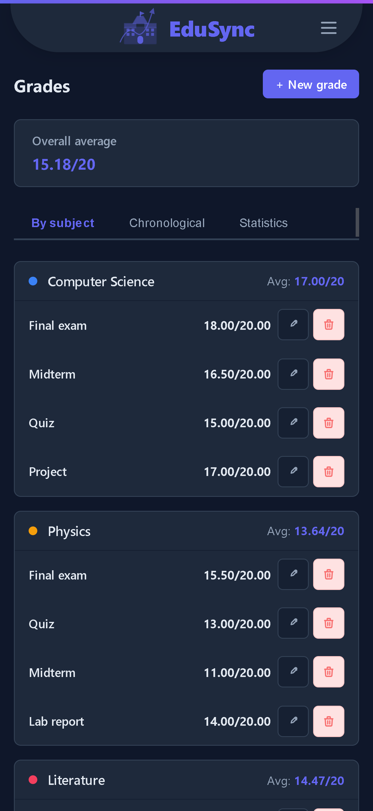 |
|:---:|:---:|:---:|
| **Dashboard** | **Courses** | **Grades** |
| 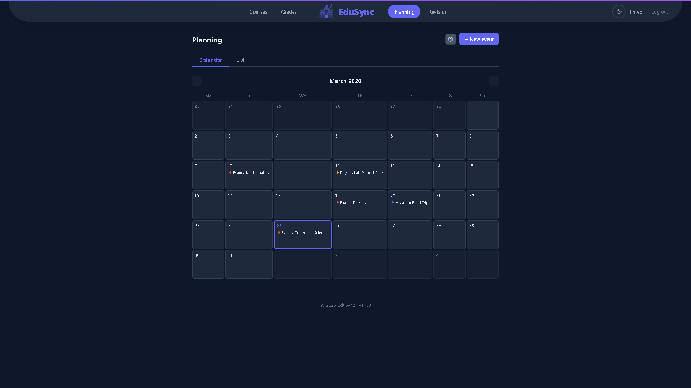 | 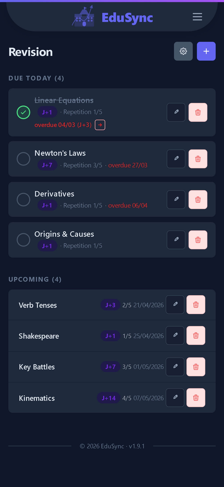 | 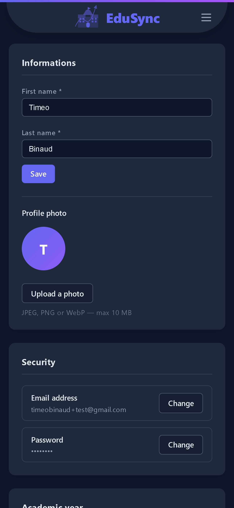 |
| **Planning** | **Revision** | **Profile** |

## Features

- **Auth** — Register/login with email & password, email verification, new-IP detection with 6-digit code by email, Remember me (60-day token with rotation)
- **Courses** — Subjects → Themes → Chapters → Documents (PDF, images, DOCX, PPT, TXT — up to 50 MB), inline viewer, HSV color picker, list/grid toggle
- **Grades** — Per-subject grade tracking with coefficients, weighted average, custom subject dropdown with color badges, custom date picker, optional comment
- **Planning** — Monthly calendar + event list, CRUD events, custom event types (add/rename/recolor/delete), dashboard week view
- **Revision** — Spaced repetition (J+1/3/7/14/30 or custom intervals), link chapters or documents, preset management, today's widget on dashboard

## Requirements

- PHP >= 8.0
- MySQL >= 8.0 (or MariaDB >= 10.4)
- Composer
- A Gmail account with an App Password (for email sending)

## Installation

```bash
# 1. Install dependencies
composer install

# 2. Copy environment file and fill in your values
cp .env.example .env

# 3. Create the database and import the schema
mysql -u root -p < database/migrations/schema.sql

# 4. Start the built-in PHP server
php -S localhost:8080 -t public
```

## Environment variables

| Variable                 | Description                                   |
|--------------------------|-----------------------------------------------|
| `DB_HOST`                | MySQL host (e.g. `localhost`)                 |
| `DB_NAME`                | Database name (e.g. `edusync`)                |
| `DB_USER`                | MySQL user                                    |
| `DB_PASS`                | MySQL password                                |
| `MAIL_HOST`              | SMTP host (e.g. `smtp.gmail.com`)             |
| `MAIL_PORT`              | SMTP port (e.g. `587`)                        |
| `MAIL_USERNAME`          | Gmail address                                 |
| `MAIL_PASSWORD`          | Gmail App Password                            |
| `MAIL_FROM_ADDRESS`      | Sender address                                |
| `MAIL_FROM_NAME`         | Sender name (e.g. `EduSync`)                  |
| `REMEMBER_MAX_DAYS`      | Max lifetime of remember-me token (e.g. `60`) |
| `REMEMBER_INACTIVE_DAYS` | Inactivity limit in days (e.g. `14`)          |

## Gmail SMTP setup

1. Go to [myaccount.google.com](https://myaccount.google.com) → Security
2. Enable 2-Step Verification
3. Security → App passwords → create one for "EduSync"
4. Copy the 16-character password into `MAIL_PASSWORD` in your `.env`

## Project structure

```
public/         Web root (index.php + assets)
src/
  Controllers/  HTTP request handlers
  Models/       Database models
  Views/        PHP templates
  Services/     MailService, AuthService
  Core/         Router, Database, Session, View
config/         Application configuration (loads .env)
database/
  migrations/   schema.sql — full database schema
```

## License

See [LICENSE](LICENSE).
